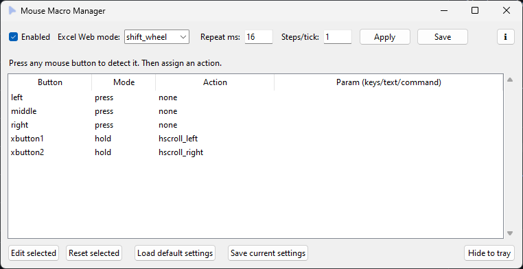

# MouseMacro Updated

A powerful, customizable mouse macro utility for Windows, written in Python. This tool allows you to remap mouse buttons to complex actions, including key combinations, text expansion, application launching, and specialized scrolling for Excel Web.



## Features

*   **GUI Configuration**: Easy-to-use graphical interface to manage button bindings.
*   **System Tray Integration**: Minimizes quietly to the system tray; keeps macros active in the background.
*   **Button Detection**: Automatically detects which mouse button you are pressing for easy setup.
*   **Multiple Action Types**:
    *   `keys`: Simulate key combinations (e.g., `ctrl+c`, `ctrl+shift+t`).
    *   `text`: Auto-type predefined text.
    *   `run`: Launch applications or run commands.
    *   `hscroll`: Specialized horizontal scrolling actions.
*   **Macro Modes**:
    *   `press`: Execute the action once per click.
    *   `hold`: Repeat the action continuously while the button is held down.
*   **Excel Web Support**: dedicate modes (`shift_wheel` and `hwheel`) to ensure smooth horizontal scrolling in Excel Online.
*   **Persistent Config**: Automatically saves your preferences to `mouse_macros.json`.

## Installation & Running

### Option 1: Run the Executable (Recommended)
You can simply run the provided `.exe` file.
*   **No specific installation required.**
*   **No Administrator privileges required** (unless you need macros to work inside Admin-level applications).

### Option 2: Run from Source (Python Script)
If you prefer to run the raw Python script (`app.py`), follow these steps:

1.  **Install Python 3.x**: Ensure Python is installed on your system.
2.  **Install Dependencies**:
    Open a terminal/command prompt in this folder and run:
    ```bash
    pip install -r requirements.txt
    ```
    (Or manually: `pip install pynput pystray Pillow`)
3.  **Run the Script**:
    ```bash
    python app.py
    ```

## User Manual

### Getting Started
1.  **Launch the App**: You’ll see the main window and a tray icon.
2.  **Default Settings**:
    *   **XButton1**: `hscroll_left` - Horizontal scroll left
    *   **XButton2**: `hscroll_right` - Horizontal scroll right
    *   **Excel Web mode**: `shift_wheel` is recommended (simulates Shift+Scroll). Use `hwheel` if that doesn't work.
    *   **Speed**: Increase **Steps/tick** to make it faster (coarser), or **Repeat ms** to make it slower (less frequent updates).
3.  **Detect a Button**: Press the mouse button you want to configure (including side buttons). If it’s not in the list, it will appear automatically.
4.  **Edit Binding**: Click the row in the list, then click **“Edit selected”**.
    *   **Mode**:
        *   `press`: Action happens once per click.
        *   `hold`: Action repeats while held down.
    *   **Action**: Choose what the button does.
    *   **Param**: Enter keys, text, or command (if needed).
5.  **Save**: Click **“Apply”** to test immediately, and **“Save”** to keep settings for next time.

### Actions Guide
*   **Horizontal Scroll (Excel Web)** (`hscroll_left` / `hscroll_right`)
    *   Recommended Mode: `hold`
    *   Works best with **Excel Web mode** set to `shift_wheel`.
*   **Send Keys** (`keys`)
    *   Param example: `ctrl+shift+t` or `alt+f4`
    *   Use `press` for one-time shortcuts.
*   **Type Text** (`text`)
    *   Param example: `hello world`
    *   Types the text string instantly.
*   **Run Program** (`run`)
    *   Param example: `notepad.exe`
    *   Launches any application or command.

### Excel Web Scrolling Tips
*   **Focus**: Click inside the Excel sheet grid before scrolling.
*   **Settings**:
    *   **Excel Web mode**: `shift_wheel` is recommended (simulates Shift+Scroll). Use `hwheel` if that doesn't work.
    *   **Speed**: Increase **Steps/tick** to make it faster (coarser), or **Repeat ms** to make it slower (less frequent updates).

### System Tray & Window Management
*   **Hide to Tray**: Click this button to close the window but keep macros running.
*   **Close (X)**: Clicking the window's X button **EXITs** the application completely.
*   **Tray Menu**: Right-click the tray icon to Show/Hide, Enable/Disable, or Quit.

## ⚠️ Important Notes

*   **Administrator Privileges**: To use macros in Admin-level apps/games, you must run this script/exe as Administrator. Otherwise, user-level is fine.
*   **"Hold" Mode Caution**: Rapid repetition (default 16ms) can spam commands. Be careful with "run" or complex keys in hold mode.
*   **Anti-Virus**: False positives are common for macro tools using low-level hooks (`pynput`).

## Troubleshooting
*   **Scrolling too fast/slow?** Adjust "Repeat ms" (timing) and "Steps/tick" (distance) in the main window.
*   **Macros not working?** Check the "Enabled" checkbox at the top or in the tray menu.

## 👤 Author
[Imamul Kadir](https://www.linkedin.com/in/imamulkadir/)
